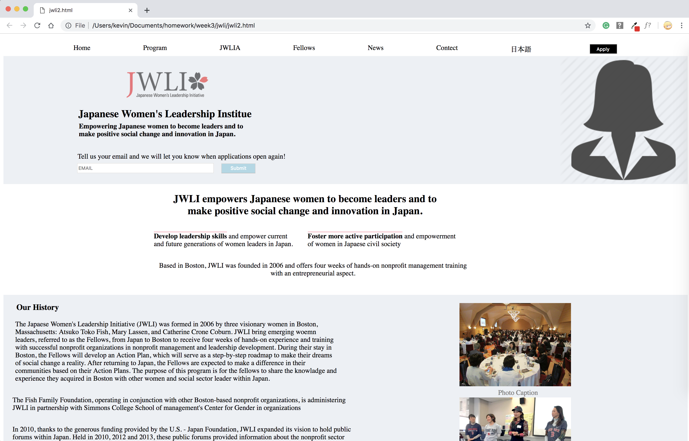

# Mock JWLI Web Page
I tried to recreate the JWLI web page.

## How It's Made:

**Tech used:** HTML, CSS

I started with the html and inputed the content of the web page. Then I linked the css file to the html. One's thats was done, I started to create the layout and place the content in place.

## Lessons Learned:
